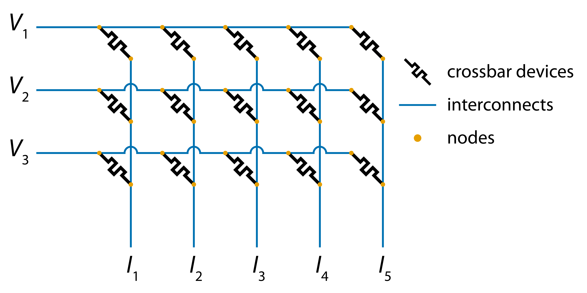
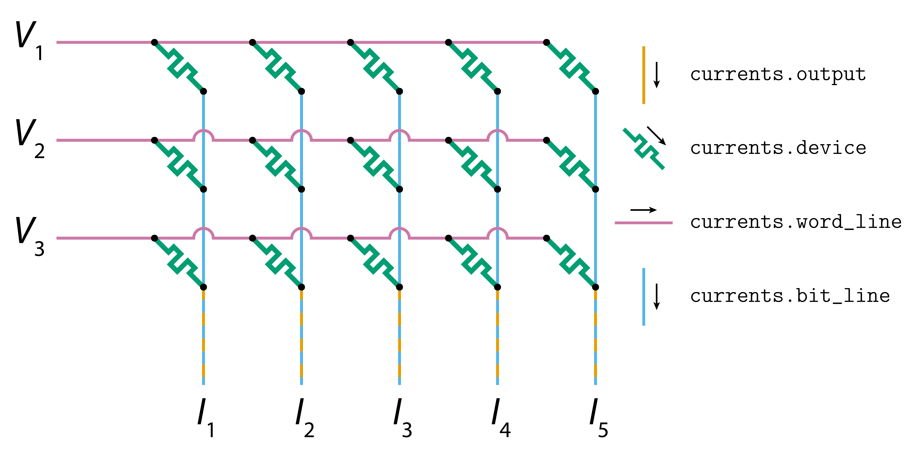
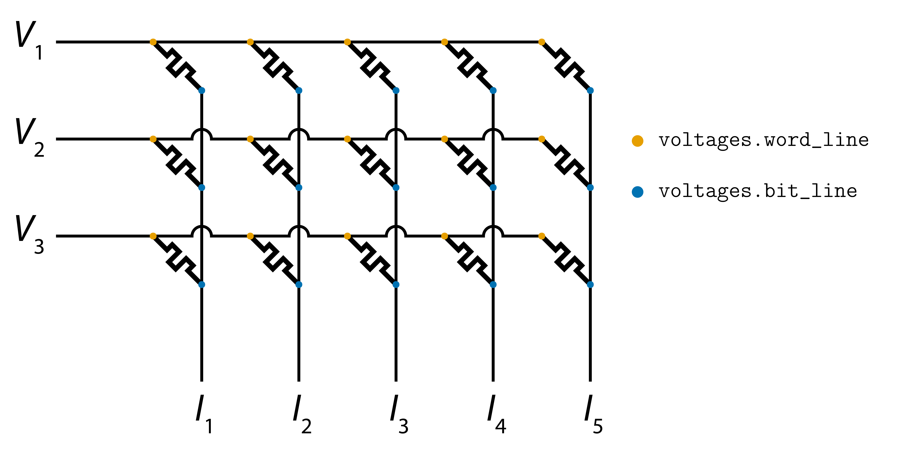

# About

[badcrossbar] is a nodal analysis solver for passive crossbar arrays that suffer from line resistance. It solves for currents in all the branches, as well as for voltages at all the nodes of the crossbar. Additionally, it can create diagrams of crossbar arrays colored according to the values of those currents and voltages (or any other variables).

# Background

Conventional crossbars have a structure like the one shown in the image below. Resistive two-terminal **devices** (depicted here as memristors) are connected to **word lines** on one side and to **bit lines** on the other. In the diagram, the crossbar devices are depicted in black, the word lines are depicted as horizontal blue lines and the bit lines as vertical blue lines. Orange circles denote the **nodes**, i.e. the connections between the devices and the word/bit lines. The segments of word and bit lines between neighbouring nodes are often seen as **interconnects** between neighbouring devices and can themselves be modelled as resistive elements.



In most practical scenarios, we want the resistance of the interconnects to be zero. That is because crossbar arrays containing resistive elements can be used as dot product engines, i.e. systems able to compute vector-matrix products in hardware. Specifically, crossbar arrays with interconnect resistance of zero are able to compute the vector-matrix products of applied voltages (vector) and conductances of the crossbar devices (matrix). In the diagram above, voltages are applied on the left side of the word lines and the vector-matrix product is computed in a form of currents at the bottom of the bit lines.

# Installation

To install the package and its dependencies, type the following lines into the terminal:
```text
git clone https://github.com/joksas/badcrossbar
cd badcrossbar
python setup.py install
```

## Windows

When installing [pycairo] package on Windows, one might encounter an error similar to the one below:
```text
error: Microsoft Visual C++ 14.0 is required. Get it with "Build Tools for Visual Studio": https://visualstudio.microsoft.com/downloads/
```

One suggested solution is to download unofficial [pycairo] binary from [University of California, Irvine website](https://www.lfd.uci.edu/~gohlke/pythonlibs/#pycairo) and install it by typing the following command into the terminal (with the correct filename):
```text
pip install C:\path\to\file\pycairo-1.19.1-cp38-cp38-win32.whl
```
As stated in the [website](https://www.lfd.uci.edu/~gohlke/pythonlibs/), "the files are provided "as is" without warranty or support of any kind. The entire risk as to the quality and performance is with you."

# Usage

## Computing currents and voltages

[badcrossbar] allows to compute branch currents and node voltages for arbitrary values of applied voltages, devices' resistances and interconnect resistance. It assumes that all interconnects have the same specified resistance and that outputs (in the bottom of bit lines) are grounded.

One can compute branch currents and node voltages with the function `badcrossbar.compute`, as shown in the code below:

```python
import badcrossbar

# applied voltages in volts
applied_voltages = [[1.5],
                    [2.3],
                    [1.7]]

# device resistances in ohms
resistances = [[345, 903, 755, 257, 646],
               [652, 401, 508, 166, 454],
               [442, 874, 190, 244, 635]]

# interconnect resistance in ohms
r_i = 0.5

# computing the solution
solution = badcrossbar.compute(applied_voltages, resistances, r_i)
```

The returned variable (named `solution`, in this case) is a named tuple with fields `currents` and `voltages`.

### Currents

`solution.currents` is itself a named tuple with fields `output`, `device`, `word_line` and `bit_line`. The first field represents the output currents, while the rest represent the currents flowing through devices, interconnects along the word lines, and interconnects along the bit lines. All of these branches are depicted in the diagram below.



If `applied_voltages` is an array of shape `(m, p)` (each column representing a different set of inputs) and `resistances` is an array of shape `(m, n)`, then:
* `currents.output` will be a [numpy] array of shape `(p, n)`.
* `currents.device`,  `currents.word_line` and `currents.bit_line` will be [numpy] arrays of shape `(m, n)` if `p = 1`, or [numpy] arrays of shape `(m, n, p)` if `p > 1`.

### Voltages

`solution.voltages` is itself a named tuple with fields `word_line` and `bit_line`. They represent the voltages at the nodes on the word and bit lines, respectively. These two types of nodes are depicted in the diagram below.



If `applied_voltages` is an array of shape `(m, p)` (each column representing a different set of inputs) and `resistances` is an array of shape `(m, n)`, then `voltages.word_line` and `voltages.bit_line` will be [numpy] arrays of shape `(m, n)` if `p = 1`, or [numpy] arrays of shape `(m, n, p)` if `p > 1`.

### Example

Suppose we applied four sets of inputs to a crossbar array and wanted to find the current flowing through the device in the first row and fourth column when the third set of inputs was applied. We could print out the current through that device using the following piece of code:

```python
import badcrossbar

# applied voltages in volts
applied_voltages = [[1.5, 4.1, 2.6, 2.1],
                    [2.3, 4.5, 1.1, 0.8],
                    [1.7, 4.0, 3.3, 1.1]]

# device resistances in ohms
resistances = [[345, 903, 755, 257, 646],
               [652, 401, 508, 166, 454],
               [442, 874, 190, 244, 635]]

# interconnect resistance in ohms
r_i = 0.5

# computing the solution
solution = badcrossbar.compute(applied_voltages, resistances, r_i)

# current that we are interested in (note zero-based indexing)
current = solution.currents.device[0, 3, 2]

print('\nCurrent through the device in question is {} A.'.format(current))
```

#### Output

```text
2020-06-14 15:09:37     Initialising simulation.
2020-06-14 15:09:37     Started solving for v.
2020-06-14 15:09:37     Solved for v.
2020-06-14 15:09:37     Extracted node voltages.
2020-06-14 15:09:37     Extracted currents from all branches in the crossbar.

Current through the device in question is 0.009856197822795886 A.
```

More examples can be found in files [1_single_set_of_inputs.py] and [2_multiple_sets_of_inputs.py].

### Perfectly insulating devices

Devices with infinite resistance can be denoted using resistance value of `numpy.inf` (or equivalently `math.inf`).

## Plotting currents and voltages (and more)

[badcrossbar] provides [`badcrossbar.plot`] module which allows to color crossbar branches and currents. This is done by functions `badcrossbar.plot.currents` and `badcrossbar.plot.voltages`, respectively. Although their primary purpose is for plotting currents and voltages, these functions accept arbitrary arrays and color the branches and nodes, according to the values of these arrays. This functionality is explained in more detail in example [3_different_variables.py].

### Currents

The function `badcrossbar.plot.currents` accepts either individual arrays for crossbar devices, word line branches and bit line branches, or a named tuple containing all currents. If any of the arrays are 3D, they are averaged along the third axis.

The following piece of code computes and plots average branch currents over four sets of applied inputs:

```python
import badcrossbar

# applied voltages in volts
applied_voltages = [[1.5, 4.1, 2.6, 2.1],
                    [2.3, 4.5, 1.1, 0.8],
                    [1.7, 4.0, 3.3, 1.1]]

# device resistances in ohms
resistances = [[345, 903, 755, 257, 646],
               [652, 401, 508, 166, 454],
               [442, 874, 190, 244, 635]]

# interconnect resistance in ohms
r_i = 0.5

# computing the solution
solution = badcrossbar.compute(applied_voltages, resistances, r_i)

# plotting average branch currents over all four sets of inputs.
# we additionally set custom filename and allow to overwrite produced PDF files
badcrossbar.plot.currents(all_currents=solution.currents,
                          filename='average-currents', allow_overwrite=True)
```

The produced PDF file should contain a diagram similar to the one shown below:


### Voltages

Similarly, `badcrossbar.plot.voltages` accepts either individual arrays for nodes on the word and bit lines, or a named tuple containing both sets of voltages. If any of the arrays are 3D, they are averaged along the third axis.

The following piece of code computes and plots average node voltages over four sets of applied inputs:

```python
import badcrossbar

# applied voltages in volts
applied_voltages = [[1.5, 4.1, 2.6, 2.1],
                    [2.3, 4.5, 1.1, 0.8],
                    [1.7, 4.0, 3.3, 1.1]]

# device resistances in ohms
resistances = [[345, 903, 755, 257, 646],
               [652, 401, 508, 166, 454],
               [442, 874, 190, 244, 635]]

# interconnect resistance in ohms
r_i = 0.5

# computing the solution
solution = badcrossbar.compute(applied_voltages, resistances, r_i)

# plotting average node voltages over all four sets of inputs
badcrossbar.plot.voltages(all_voltages=solution.voltages,
                          filename='average-voltages', allow_overwrite=True)
```

The produced PDF file should contain a diagram similar to the one shown below. Because the crossbar array, in this case, is small and the interconnect resistance is small relative to the resistance of the devices, we do not see much variation between voltages of nodes of the same type. Differences become more apparent with larger crossbar arrays, as explored in [2_custom_parameters.py], for example.


Examples of how to plot currents or voltages of only certain parts of the crossbar, or how to take into account only part of the sets of applied voltages can be found in [1_default_parameters.py].

### Modifying diagrams

Plotting  module produces vector images (as PDF files) that can then be edited in any vector graphics manipulation program. However, it also provides option to modify some of the features of the diagram that might be difficult to change once the image is produced. Example [2_custom_parameters.py] explores some of these options, while the complete list of modifiable parameters can be found in function docstrings of [`badcrossbar.plot`] module.

[badcrossbar]:https://github.com/joksas/badcrossbar
[numpy]:https://github.com/numpy/numpy
[pycairo]:https://github.com/pygobject/pycairo
[`badcrossbar.plot`]:badcrossbar/plot.py
[1_single_set_of_inputs.py]:examples/computing/1_single_set_of_inputs.py
[2_multiple_sets_of_inputs.py]:examples/computing/2_multiple_sets_of_inputs.py
[1_default_parameters.py]:examples/plotting/1_default_parameters.py
[2_custom_parameters.py]:examples/plotting/2_custom_parameters.py
[3_different_variables.py]:examples/plotting/3_different_variables.py
